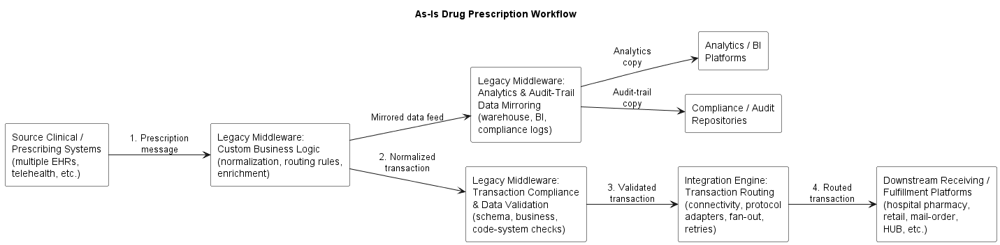

# 01 – As‑Is Overview

## 1. Current prescription integration landscape

Today, a single drug prescription passes through a **linear chain of heterogeneous middleware components** before reaching the final fulfillment platform:

1. **Source clinical / prescribing systems (multiple)**  
   - Hospital/clinic EHRs, ambulatory systems, telehealth platforms, or other prescribing applications.  
   - Emit prescription messages in various formats (e.g., HL7 v2, NCPDP SCRIPT, proprietary APIs/files).

2. **Legacy middleware – custom business logic processing**  
   - Normalizes data from different sources and standards into an internal representation.  
   - Applies routing hints and non‑clinical business rules (e.g., preferred pharmacy networks, basic enrichment, code mapping).

3. **Legacy middleware – analytics & audit‑trail data mirroring**  
   - Mirrors each Rx transaction and status change into enterprise-owned analytics and audit repositories (data warehouse/lake, compliance logs).  
   - Maintains cross‑system data lineage (transaction IDs, correlation IDs, error/status codes).

4. **Legacy middleware – transaction compliance & data validation**  
   - Performs structural/schema checks, business rule validation, and basic compliance checks before the transaction is allowed to proceed.  
   - Blocks non‑compliant messages and records legacy status/error codes.

5. **Integration engine – transaction routing**  
   - Routes validated transactions to one or more downstream systems (hospital pharmacy, retail/mail‑order pharmacy, HUB/specialty platforms).  
   - Handles protocol/format mediation, connectivity, fan‑out, retries, and delivery monitoring.

6. **Downstream receiving / fulfillment platforms (multiple)**  
   - Internal hospital pharmacy systems, retail/mail‑order pharmacies, specialty pharmacies, and HUB platforms.  
   - Fulfill prescriptions, manage inventory, and send back status updates through the same or parallel integration paths.

### As‑Is diagram

---

## 2. Assumptions about the as‑is environment

To make the analysis concrete, the following pragmatic assumptions are made:

- There are multiple heterogeneous prescribing systems (at least one hospital EHR and one ambulatory/telehealth system), using a mix of HL7 v2, SCRIPT, and proprietary formats.  
- There are multiple fulfillment platforms (at least one internal hospital pharmacy system and one external pharmacy/HUB), each with its own interface constraints.  
- The legacy middleware components and integration engine are separately owned/configured, with overlapping responsibilities (e.g., some validation in multiple places).  
- The analytics/audit middleware primarily feeds the pharma company’s own data and compliance platforms, not partner hospitals’ warehouses.  
- Non‑functional requirements (availability, latency, volume) are met today, but at the cost of operational complexity and difficult change management.

These assumptions are explicitly documented so that they can be challenged or refined in a real project.

---

## 3. Key pain points

The current setup creates several issues for both business and technology stakeholders:

- **Fragmented business logic and validation**  
  - Rules are spread across at least three middleware components and the integration engine, making it hard to understand or change the end‑to‑end behavior.  
  - Consistency of validations and routing policies across different flows and partners is difficult to guarantee.

- **Complex onboarding of new systems and flows**  
  - Adding a new prescribing system or fulfillment partner often requires changes in multiple boxes (custom logic, validation middleware, routing engine, analytics feeds).  
  - Each new integration can introduce yet another variation of message standard or mapping.

- **Limited transparency and observability**  
  - End‑to‑end tracing of a prescription (from source through all middleware to fulfillment and analytics) is possible but cumbersome.  
  - Monitoring and troubleshooting are spread across several tools and teams.

- **Technical debt and vendor dependency**  
  - Multiple legacy middleware platforms increase licensing, maintenance, and skill requirements.  
  - Some components may be near end‑of‑life or poorly documented, increasing operational risk.

- **Barriers to adopting modern interoperability patterns**  
  - The engine‑centric, message‑format‑driven design makes it hard to introduce clean FHIR/REST APIs and clear, versioned interface contracts.  
  - Reuse of data and logic across clinical, supply, and analytics use cases is limited by the current architecture.

---

## 4. Why change is needed

To support future growth, interoperability, and analytics, the company needs to:

- Preserve critical business behavior (who gets which prescription, with which checks and audit trail) while reducing architectural complexity.  
- Standardize around FHIR and RESTful APIs as the canonical way to represent and exchange Rx transactions, even in a mixed HL7 v2/SCRIPT world.  
- Consolidate validation, routing, and analytics export into a single, well‑governed Rhapsody‑based integration layer, without directly managing partner DWHs.  
- Improve changeability and onboarding so new sources/targets and new use cases can be supported with predictable effort and lower risk.

The next document, [`03-target-architecture-and-flow.md`](./03-target-architecture-and-flow.md), describes how the target design with FHIR, REST, and Rhapsody addresses these pain points while preserving essential business behavior.
