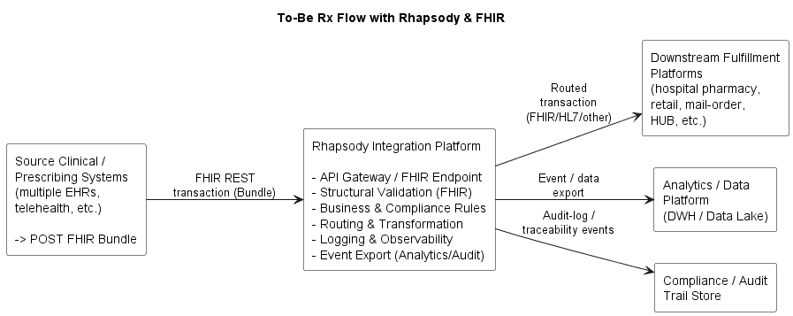
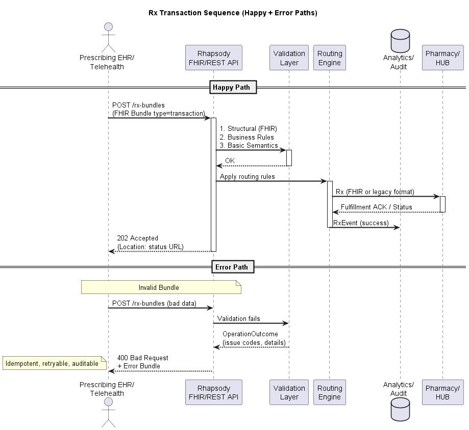

# 03 – Target Architecture and Rx Flow

## 1. Target architecture overview

The target state replaces multiple legacy middleware components with a **single, Rhapsody‑centric integration platform** that uses **FHIR and RESTful APIs** as the canonical interface for prescription transactions.

### Core principles

- **FHIR as the canonical Rx model**
  Internally, each prescription is represented as a FHIR transaction `Bundle`, providing a single canonical business transaction that groups Patient, Prescriber, MedicationRequest, Coverage, and Pharmacy context.
  

- **Rhapsody as the central integration hub**  
  Rhapsody hosts FHIR REST endpoints, performs validation and routing, and publishes standardized events to enterprise analytics and audit platforms.

- **Adapters at the edges**  
  Legacy formats (HL7 v2, SCRIPT, proprietary) are handled via Rhapsody adapters at the boundaries, while the internal logic operates on the FHIR Bundle.

The structure of the FHIR integration documentation supporting this architecture is described in  [`01-fhir-integration-documentation-approach.md`](./01-fhir-integration-documentation-approach.md).

### To‑Be architecture diagram

---

## 2. Rhapsody responsibilities and internal layers

Within the single integration platform, responsibilities are separated into clear layers rather than separate middleware boxes:

1. **API gateway / ingress**  
   - Exposes REST endpoints (e.g., `POST /rx-bundles`) accepting FHIR Bundles from prescribing systems.  
   - Optionally fronted by an API gateway for authentication, throttling, and tenant/partner management.

2. **Input adapters and canonicalization**  
   - HL7 v2, SCRIPT, or proprietary messages are received via Rhapsody adapters.  
   - Each input is transformed into the canonical **Rx FHIR transaction Bundle**.

3. **Validation layer**  
   - **Structural validation**: FHIR schema and profile checks on the Bundle.  
   - **Business validation**: required fields, status transitions, consent flags, mandatory diagnosis/pharmacy for certain drugs.  
   - **Semantic/value‑set checks**: key code systems (medications, diagnosis, pharmacy IDs, payer IDs) validated against reference data where available.  
   - Failed validations generate clear error responses and are logged to the audit store; the transaction is not routed further.

4. **Routing and transformation**  
   - Determines one or more downstream targets (hospital pharmacy, retail, mail‑order, HUB) based on rules (pharmacy ID, drug type, payer, geography, etc.).  
   - Applies target‑specific transformations (e.g., FHIR → HL7 v2, FHIR → SCRIPT, or FHIR → target‑specific JSON/XML).

5. **Delivery and reliability**  
   - Manages queuing, retries, and dead‑lettering for downstream endpoints.  
   - Captures delivery outcomes and error events for monitoring and audit.

6. **Analytics and audit export**  
   - Publishes normalized Rx events (submitted, validated, routed, delivered, failed) to enterprise **analytics and audit platforms**.  
   - Provides end‑to‑end traceability for each prescription via correlation IDs and status codes.
  
7. **Validation ownership and governance**  
   - A cross-functional **Validation Working Group (VWG)** — comprising clinical, compliance, integration, and product leads plus representatives from each prescribing system team — owns the validation rule set.  
   - Rule changes follow a defined process: proposal → VWG impact assessment → sign-off for blocking rules (or notification-only for warning-level rules) → deployment with a minimum 2-week notice to affected prescribing system teams.  
   - All rules are versioned and documented in the Validation Rules Catalog (see [`01-fhir-integration-documentation-approach.md`](./01-fhir-integration-documentation-approach.md)).  
   - If a prescribing system disputes a rejection, the integration team reviews within 1 business day. Unresolved disputes escalate to the product owner for a binding decision within 3 business days. Temporary rule exceptions can be issued while a dispute is under review.  
   - No prescription is silently discarded: every rejection is logged with a correlation ID, error code, and human-readable reason accessible to the submitting system.

---

## 3. Target Rx transaction and API flow

At a high level, the end‑to‑end flow is:

The following sequence diagram illustrates this flow end-to-end, from prescribing system submission through validation, routing, fulfillment, and audit publishing:

1. **Prescribing system → Rhapsody (ingress)**  
   - The source system submits a prescription as either:  
     - A FHIR Rx transaction `Bundle` via REST, or  
     - A legacy message (HL7 v2, SCRIPT) via an adapter.  
   - Rhapsody transforms any legacy message into the canonical FHIR Bundle.

2. **Validation before routing**  
   - The canonical Bundle is validated structurally and against core business/semantic rules.  
   - If validation fails, an error is returned synchronously (for REST calls) or via a defined error channel (for non‑REST inputs).  
   - Validation outcomes are logged to the audit store.

3. **Routing and target preparation**  
   - Based on the Bundle content (pharmacy ID, medication type, payer, etc.), Rhapsody selects one or more downstream fulfillment platforms.  
   - Target‑specific messages are generated (e.g., HL7 v2 message for hospital pharmacy, SCRIPT for retail, API call for a HUB).

4. **Delivery and status handling**  
   - Rhapsody delivers the transformed message(s) to the selected targets and captures delivery outcomes.  
   - Downstream systems send back status updates (received, in progress, dispensed, failed), which Rhapsody can map back into FHIR and optionally expose via a status API.

5. **Analytics and audit publishing**  
   - Each key event (submission, validation, routing decision, delivery result, status update) is published as a standardized Rx event into enterprise analytics and audit stores for traceability and reporting.

---

## 4. RESTful interaction style

For MVP, we expose a simplified REST interface that accepts FHIR Bundles rather than a full generic FHIR server. This reduces integration complexity for heterogeneous clients while preserving FHIR as the canonical payload.

The primary interaction style is **request/response for submission** and **optionally asynchronous for status updates**:

- **Synchronous submission (prescribing → Rhapsody)**  
  - `POST /rx-bundles`  
    - Request: FHIR Rx transaction Bundle.  
    - Response:  
      - `201 Created` with a transaction ID/correlation ID for success.  
      - `4xx` with error details for validation failures.  
  - Legacy inputs (HL7 v2, SCRIPT) use equivalent endpoints or transports, but all converge to the same internal flow.

- **Status retrieval (optional synchronous)**  
  - `GET /rx-status/{transactionId}`  
    - Returns current status, key timestamps, and last known error (if any).

- **Asynchronous updates (downstream → Rhapsody → source)**  
  - Downstream platforms send status updates (e.g., via API or messages).  
  - Rhapsody can push notifications back to the source (e.g., webhook/callback) or make them available via the status API.

The detailed API contract, including request/response schemas and error models, is described in [`05-api-spec-and-error-handling.md`](./05-api-spec-and-error-handling.md).
---

## 5. Synchronous vs asynchronous parts

- **Synchronous**  
  - Initial submission of the Rx Bundle and immediate validation outcome.  
  - The prescriber gets fast feedback if the transaction is structurally or semantically invalid.

- **Asynchronous**  
  - Fulfillment processing and status updates (dispensed, partially filled, failed, cancelled).  
  - Retry and failure handling toward downstream platforms.  
  - Analytics and audit event publishing.

This balance ensures prescribers get quick usability feedback while allowing complex fulfillment and supply-chain activities to execute reliably and decoupled from the initial call.

---

## 6. Validation before routing

Validation is an explicit gate before any routing occurs:

1. **Technical/structural checks**  
   - FHIR Bundle must be well‑formed, conform to the agreed profile, and include mandatory resources (e.g., Patient, MedicationRequest, Prescriber, Pharmacy).

2. **Business checks**  
   - Mandatory fields: prescription number, status, order priority, consent when required, payer/coverage where needed.  
   - Logical consistency (e.g., status transitions, date relationships, quantity vs refills).

3. **Semantic/value-set checks (core subset)**  
   - Key codes (medication, diagnosis, pharmacy ID, payer ID) are checked against reference lists or terminology services where available.  
   - Non‑critical or unknown codes may be flagged but not always blocked, based on policy.

Only prescriptions that pass these checks are eligible for routing to fulfillment platforms. Rejected transactions are returned with clear error messages and logged.

In high-throughput environments, validation must be optimized to balance strictness and performance. Critical blocking rules (structural and key business validations) are enforced synchronously, while non-critical semantic checks may be handled asynchronously or downgraded to warnings to avoid unnecessary rejection of prescriptions and to maintain system responsiveness.

---

## 7. Error and negative flows

Error handling is designed to be predictable and observable:

- **Validation failures**  
  - Synchronous REST calls return a structured error response with:  
    - Error type (structural, business, semantic).  
    - Human‑readable message.  
    - Field/location references where possible.  
  - Legacy inputs receive equivalent error notifications over their channels.  
  - All failures are logged to the audit store with correlation IDs for troubleshooting.

- **Routing/delivery failures**  
  - If a downstream endpoint is unavailable or fails:  
    - Rhapsody retries according to configurable policies.  
    - After retry exhaustion, the message is moved to a dead‑letter queue and an error event is emitted.  
  - The Rx status for that transaction is marked as “delivery failed” or similar in the status API/audit logs.

- **Partial failures / multi‑target scenarios**  
  - If one target succeeds and another fails, events are recorded per target.  
  - Business rules define whether the overall transaction is considered successful or requires intervention.

This model gives both operational teams and business stakeholders a clear view of where and why a prescription flow failed.

---

## 8. Link to other documents

- The **FHIR Rx Bundle profile** used as the canonical transaction is described in detail in [`04-fhir-rx-bundle-profile.md`](./04-fhir-rx-bundle-profile.md).  
- The concrete API surface, request/response patterns, and error schemas are detailed in [`05-api-spec-and-error-handling.md`](./05-api-spec-and-error-handling.md).
